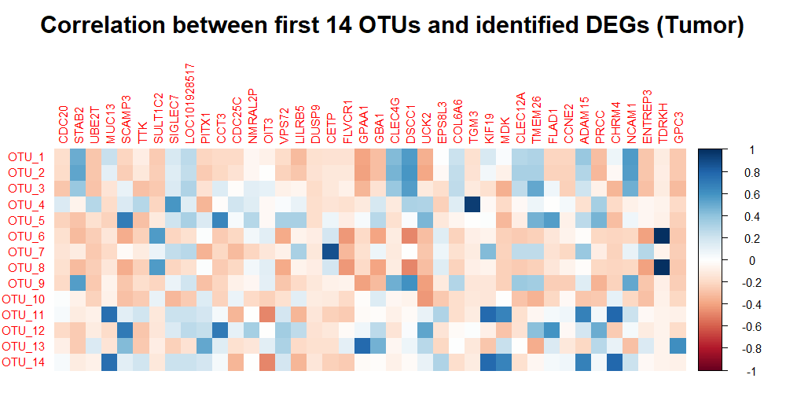

```{r setup, include=FALSE}
knitr::opts_chunk$set(echo = FALSE)
```

# Introduction

This project investigates the relationship between gut microbiota composition and host gene expression in *hepatocellular carcinoma (HCC)* by integrating 16S rRNA sequencing data with liver RNA-seq profiles. The microbiome data were analyzed to explore microbial diversity, while the transcriptomic data were used to identify differentially expressed genes in HCC and to search for potential biomarkers. An attempt was also made to examine correlations between the gut microbiota and tumor development, however, due to the lack of metadata necessary to determine which fecal samples correspond to which patients, these correlation results may not be fully reliable. 

All data used in this project were obtained from the study *Huang et al. (2020)*, available at [Genome Medicine](https://genomemedicine.biomedcentral.com/articles/10.1186/s13073-020-00796-5).

## Required libraries
```{r libraries, echo=TRUE, message=FALSE, warning=FALSE, message=FALSE}
#if (!requireNamespace("BiocManager", quietly = TRUE))
#    install.packages("BiocManager")
library(dada2)
library(phyloseq)
library(ggplot2)
library(reshape2)
library(tidyr)
library(dplyr)
library(patchwork)
library(DESeq2)
library(tibble)
library(ggrepel)
library(org.Hs.eg.db)
library(AnnotationDbi)
library(pheatmap)
library(RColorBrewer)
library(clusterProfiler)
library(enrichplot)
library(caret)
library(corrplot)
```

# Microbiome Data Analysis

## 16S Data Pre-Processing

The 16S rRNA sequencing data were obtained from the **European Nucleotide Archive (ENA)** under project accession [PRJEB8708](https://www.ebi.ac.uk/ena/browser/view/PRJEB8708). The downloaded raw sequencing reads were organized and stored in the `data/16S/raw_reads` directory.

```{r file_paths, echo=TRUE, message=FALSE}
raw_path <- "./data/16S/raw_reads"
fwds <- sort(list.files(raw_path, pattern = "_1.fastq.gz", full.names = TRUE))
revs <- sort(list.files(raw_path, pattern = "_2.fastq.gz", full.names = TRUE))

sample_names <- sapply(strsplit(basename(fwds), "_"), `[`, 1)
```

### Filtering and Trimming Reads

Before **trimming and filtering**, the quality of raw reads was inspected using `plotQualityProfile()` function from DADA2 package. As is typical for Illumina sequencing, a decline in quality was observed toward the end of the reads, particularly in reverse reads. By visualizing the quality profiles of the first two samples for both forward and reverse reads, the points at which the median quality score began to drop were identified, allowing the appropriate selection of truncation parameters for downstream analysis.

```{r qualityCheck, echo=TRUE, message=FALSE, warning=FALSE, eval=FALSE}
plotQualityProfile(fwds[1:2])
plotQualityProfile(revs[1:2])
```
<div style="display: flex; justify-content: space-between;">


</div>

The **quality profiles** of the first two samples show that forward reads maintain high quality (Q>30) up to the cycle 270-280. However, after that point we observe rapid drop of quality. Reverse reads, as expected, show a steeper decline in quality starting around cycle 160-170. Based on this inspection, forward reads were truncated at position **270** and reverse reads at position **160** using `truncLen=c(270, 160)` parameter in the `filterAndTrim()` function from the DADA2 package, ensuring that only the most reliable fragments of the reads are retained for further denoising and analysis.

```{r filtering_and_trimming, echo=TRUE, message=FALSE, warning=FALSE, eval=FALSE}
filtered_path <- "./data/16S/filtered_reads"
dir.create(filtered_path)

fwds_filtered <- file.path(filtered_path, paste0(sample_names, "_F_filtered.fastq.gz"))
revs_filtered <- file.path(filtered_path, paste0(sample_names, "_R_filtered.fastq.gz"))

filterAndTrim(fwds, fwds_filtered, revs, revs_filtered,
                     truncLen = c(270, 160),
                     maxN = 0,
                     maxEE = c(2, 2),
                     truncQ = 2,
                     rm.phix = TRUE,
                     compress = TRUE,
                     multithread = TRUE)
```

### Denoising reads

**Denosing** reads is a key step in the DADA2 pipeline that removes sequencing errors to recover true biological sequences. By correcting these errors, denoising enebles the accurate inference of **amplicon sequence variants (ASVs)** with single-nucleotide resolution, proving a high-precision view of microbial composition. 

To perform effective denoising, DADA2 first needs to learn how errors occur in the data. This is done by using the `leanErrors()` function, which models the probability of each type of sequencing error by examining a subset of the reads. Separate error profiles were estimated for forward and reverse reads.

```{r learning_errors, echo=TRUE, message=FALSE, warning=FALSE, eval=FALSE}
err_fwd <- learnErrors(fwds_filtered, multithread = TRUE)
err_rev <- learnErrors(revs_filtered, multithread = TRUE)

plotErrors(err_fwd, nominalQ = TRUE)
plotErrors(err_rev, nominalQ = TRUE)
```
<div style="display: flex; justify-content: space-between;">


</div>

The error rate plots visualize how well the DADA2 model captures sequencing error patterns by comparing observed error frequencies (*black points*) with the fitted error model (*red lines*) across all possible nucleotide transitions. In both panels (for forward and reverse reads) we see that the black points closely follow the red lines across base substitution types. This indicates a good fit between the model and the data, suggesting that the learned error model accurately reflect the actual error behavior in the dataset.

The next step in the DADA2 pipeline is **dereplication**, which involves collapsing identical sequencing reads within each sample into unique sequences. This process significantly reduces computional complexity and increases the efficiency by removing redundancy from the dataset. Performing dereplication before error correction allows DADA2 to more effectively distinguish true biological variation from sequencing errors.

```{r dereplication, echo=TRUE, warning=FALSE, message=FALSE, eval=FALSE}
fwds_dereplicated <- derepFastq(fwds_filtered, verbose=TRUE)
revs_dereplicated <- derepFastq(revs_filtered, verbose=TRUE)

names(fwds_dereplicated) <- sample_names
names(revs_dereplicated) <- sample_names
```

With dereplicated data prepared we now proceed to denoising, where DADA2 applies its leaned error models to infer the true composition of the microbial community. By evaluating each unique sequence in the context of its frequency and the expected error rate, DADA2 determines whether the sequence is likely a genuine variant or a result of sequencing noise. This results in high-resolution ASVs, which provide more accurate insight into microbial diversity.

```{r denoising, echo=TRUE, warning=FALSE, message=FALSE, eval=FALSE}
dada_fwd <- dada(fwds_dereplicated, err = err_fwd, multithread = TRUE)
dada_rev <- dada(revs_dereplicated, err = err_rev, multithread = TRUE)
```

### Merging paired-end reads

The next step is **merging paired-end reads**, which combines the denoised forward and reverse reads for each sample into complete sequences. Only paired reads with sufficient overlap and matching sequences in the overlapping region are successfully merged, which improves the overall accuracy and filters out low-quality reads that cannot be reliably aligned.

```{r merging, echo=TRUE, warning=FALSE, message=FALSE, eval=FALSE}
merged_reads <- mergePairs(dada_fwd, fwds_dereplicated, dada_rev, revs_dereplicated, verbose=TRUE)
```

### Taxonomic classification

After successfully merging paired-end reads, the next step is to construct a sequence table using the `makeSequenceTable()` function. This function compiles all merged sequences across samples into a matrix, where each row corresponds to a sample and each column corresponds to a unique ASV. In case of this dataset, we have retained **221 ASVs for 15 samples**.

```{r sequence_table, echo=TRUE, warning=FALSE, message=FALSE, eval=FALSE}
sequence_table <- makeSequenceTable(merged_reads)
dim(sequence_table)
```

However, **not all of these ASVs necessarily represent real biological sequences**. During PCR amplification, chimeric sequences can arise when fragments from different DNA are joined together. These chimeras can distort taxonomic assignments, that's why we use `removeBimeraDenovo()` function to identify and eliminate chimeric fragments across all samples. After this quality control, the number of retained ASVs is reduced- from **221** to **194**.

```{r remove_chimeras, echo=TRUE, warning=FALSE, message=FALSE, eval=FALSE}
sequence_table.nochim <- removeBimeraDenovo(sequence_table, method="consensus", multithread=TRUE, verbose=TRUE)
dim(sequence_table.nochim)
```

The final step of 16S microbiome data pre-processing is **taxonomic classification**, where biological meaning is assigned to each unique sequence variant identified. Using reference database (such as [SILVA](https://www.arb-silva.de/documentation/release-138.1/)), the `assignTaxonomy()` function compares each ASV to known sequences and assigns it to the appropriate taxonomic ranks. 

```{r assign_taxa, echo=TRUE, warning=FALSE, message=FALSE, eval=FALSE}
taxa <- assignTaxonomy(seqtab.nochim, "data/16S/silva_nr99_v138.1_train_set.fa.gz", multithread = TRUE)

write.csv(sequence_table.nochim, "./data/results/otu_table.csv")
write.csv(taxa, "./data/results/taxonomy_table.csv")
```

## 16 Data Analysis

### Alpha Diversity Analysis

**Alpha diversity** measures the diversity within individual samples, capturing both **richness** (the number of different taxa present) and **evenness** (how evenly distributed those taxa are). It provides insight into the complexity of microbial communities and is commonly used to compare microbial composition across samples.

In this analysis, we calculate three standard alpha diversity indices: 

- **Shannon**- accounts for both richness and evenness, giving more weight to rare species (higher values indicate more diverse and evenly distributed communities),

- **Simpson**- measures the probability that two individuals randomly selected from a sample belong to the same species, giving more weight to dominant taxa (lower values indicate higher diversity),

- **Inverse Simpson**- simplifies interpretation by assigning higher values to more diverse communities.

```{r alpha_diversity, echo=TRUE, warning=FALSE, message=FALSE, eval=FALSE}
otu_df <- read.csv("data/results/otu_table.csv", row.names = 1, check.names = FALSE)
otu <- otu_table(as.matrix(otu_df), taxa_are_rows = FALSE)

taxa_df <- read.csv("data/results/taxonomy_table.csv", row.names = 1, check.names = FALSE)
taxa <- tax_table(as.matrix(taxa_df))

ps <- phyloseq(otu, taxa)

alpha_div <- estimate_richness(ps, measures = c("Shannon", "Simpson", "InvSimpson"))
alpha_div_filtered <- alpha_div %>% filter(Shannon != 0)
alpha_long <- alpha_div_filtered %>%
  pivot_longer(cols = c(Shannon, Simpson, InvSimpson),
               names_to = "Measure",
               values_to = "Value")

ggplot(alpha_long, aes(x = Measure, y = Value, fill = Measure)) +
  geom_violin(trim = FALSE, alpha = 0.7) +
  geom_jitter(width = 0.15, size = 1, alpha = 0.8) +
  labs(title = "Alpha Diversity Measures",
       x = "Diversity Measure",
       y = "Value") +
  theme_minimal() +
  theme(plot.title = element_text(hjust = 0.5),
        legend.position = "right") +
  coord_cartesian(ylim = c(0, 15))
```
<div style="display: flex; justify-context: center;">

</div>

The plot shows that most samples have **moderate alpha diversity**, with the Inverse Simpson index revealing the greatest variability—indicating some highly diverse, evenly distributed communities. Shannon values are more consistent, suggesting moderate richness and evenness across samples, while Simpson values are tightly clustered, reflecting lower sensitivity to rare taxa.

### Beta Diversity Analysis

**Beta diversity** using **Bray-Curtis distance** is calculated to assess how different microbial communities are between samples based on both the presence and the abundance of taxa. It helps with identifying patterns of community variation, such as clustering by condition or treatment group.

```{r beta_diversity, echo=TRUE, message=FALSE, warning=FALSE, eval=FALSE}
ps <- prune_samples(sample_sums(ps) > 0, ps)

bray <- ordinate(ps, method = "NMDS", distance = "bray")

plot_ordination(ps, bray, type = "samples") +
  geom_point(size = 3, aes(color = factor(sample_names(ps)))) +
  ggtitle("Bray-Curtis Distance") +
  theme_minimal() + 
  labs(color = "Sample") +
  theme(plot.title = element_text(hjust = 0.5))
```
<div style="display: flex; justify-context: center;">

</div>

Each point on the plot represents a sample and the distance between these points reflects differences in their microbial community composition. The broad spread of these points suggests **high beta diversity**, meaning the samples differ substantially in taxonomic composition. The absence of distinct clusters implies that the samples do not group according to a shared characteristic.

### Taxonomic Composition Analysis

**Taxonomic composition analysis** identifies which microbes are present in each sample and how abundant they are. This provides insight into the structure of microbial communities and how they vary across samples.

- **Phylum**: the broadest level, highlighting major microbial groups (e.g. *Cyanobacteria*, *Proteobacteria*)

- **Family**: intermediate level, offers more detail while still being general (e.g. *Bacteroidaceae*)

- **Genus**: more specific, allows detection of particular microbial genera (e.g., *Bacteroides*), useful for linking taxa to biological functions or disease

```{r taxonomic_composition, echo=TRUE, message=FALSE, warning=FALSE, eval=FALSE}
levels <- c("Phylum", "Family", "Genus")
ps_rel <- transform_sample_counts(ps, function(x) x / sum(x))

for (level in levels) {
    ps_level <- tax_glom(ps_rel, taxrank = level)
    
    p <- plot_bar(ps_level, fill = level) +
    labs(title = paste("Composition at", level, "Level"),
         y = "Relative Abundance") +
    theme_minimal() +
    theme(axis.text.x = element_text(angle = 45, hjust = 1))
  
    ggsave(filename = paste0("figures/", tolower(level), "_composition.png"),
         plot = p, width = 10, height = 6)
}
```
<div style="display: flex; justify-content: space-between;">


</div>

The bar plots reveal that many samples are strongly dominated by ***Proteobacteria*** at the phylum level and ***Prevotellaceae*** at the family level, with ***Prevotella*** being the most common genus. Some species of *Prevotella* may have beneficial effects on health (e.g. improved glucose metabolism), while others may be associated with negative outcomes (e.g. inflammatory bowel disease and non-alcoholic steatohepatisis). The dominance of a few taxa across multiple samples also suggests a low overall microbial diversity.

# Liver Data Analysis

## RNA-Seq Data Analysis

The [GSE138485](https://www.ncbi.nlm.nih.gov/geo/query/acc.cgi?acc=GSE138485) dataset includes RNA-seq expression profiles from 32 patients with *hepatocellular carcinoma (HCC)*, each contributing paired tumor and adjacent non-tumor liver tissue sample. The data includes pre-processed gene-level count matrix, so no raw read alignment or quantification is required.

### Histograms of log₂ fold changes

By comparing expression levels between tumor and non-tumor samples, significantly up- or downregulated genes can be identified, providing insight into the molecular mechanisms underlying HCC. To visualize these differences, **histograms of log₂ fold changes** were first generated.

- One for **all genes**, to examine the global expression landscape.

- One for **significant genes** only (adjusted p < 0.05 and |log₂FC| ≥ 0.8), to highlight biologically meaningful changes.

```{r echo=FALSE}
sample_conditions <- c(
  GSM4109609 = "tumor",
  GSM4109610 = "tumor",
  GSM4109611 = "tumor",
  GSM4109612 = "tumor",
  GSM4109613 = "tumor",
  GSM4109614 = "tumor",
  GSM4109615 = "tumor",
  GSM4109616 = "tumor",
  GSM4109617 = "tumor",
  GSM4109618 = "tumor",
  GSM4109619 = "tumor",
  GSM4109620 = "tumor",
  GSM4109621 = "tumor",
  GSM4109622 = "tumor",
  GSM4109623 = "tumor",
  GSM4109624 = "tumor",
  GSM4109625 = "tumor",
  GSM4109626 = "tumor",
  GSM4109627 = "tumor",
  GSM4109628 = "tumor",
  GSM4109629 = "tumor",
  GSM4109630 = "tumor",
  GSM4109631 = "tumor",
  GSM4109632 = "non_tumor",
  GSM4109633 = "non_tumor",
  GSM4109634 = "non_tumor",
  GSM4109635 = "non_tumor",
  GSM4109636 = "non_tumor",
  GSM4109637 = "non_tumor",
  GSM4109638 = "non_tumor",
  GSM4109639 = "non_tumor",
  GSM4109640 = "non_tumor",
  GSM4109641 = "non_tumor",
  GSM4109642 = "non_tumor",
  GSM4109643 = "non_tumor",
  GSM4109644 = "non_tumor",
  GSM4109645 = "non_tumor",
  GSM4109646 = "non_tumor",
  GSM4109647 = "non_tumor",
  GSM4109648 = "non_tumor",
  GSM4109649 = "non_tumor",
  GSM4109650 = "non_tumor",
  GSM4109651 = "non_tumor",
  GSM4109652 = "non_tumor",
  GSM4109653 = "non_tumor",
  GSM4109654 = "non_tumor",
  GSM4184958 = "tumor",
  GSM4184959 = "tumor",
  GSM4184960 = "tumor",
  GSM4184961 = "tumor",
  GSM4184962 = "tumor",
  GSM4184963 = "tumor",
  GSM4184964 = "tumor",
  GSM4184965 = "tumor",
  GSM4184966 = "tumor",
  GSM4184967 = "non_tumor",
  GSM4184968 = "non_tumor",
  GSM4184969 = "non_tumor",
  GSM4184970 = "non_tumor",
  GSM4184971 = "non_tumor",
  GSM4184972 = "non_tumor",
  GSM4184973 = "non_tumor",
  GSM4184974 = "non_tumor",
  GSM4184975 = "non_tumor"
)

```

```{r log2_changes, echo=TRUE, message=FALSE, warning=FALSE, eval=FALSE}
counts <- read.delim("data/RNA-Seq/GSE138485_raw_counts_GRCh38.p13_NCBI.tsv.gz", 
                     header = TRUE, stringsAsFactors = FALSE, check.names = FALSE)
rownames(counts) <- counts$GeneID
counts <- counts[, -1]

coldata <- data.frame(row.names = names(sample_conditions),
                      condition = factor(sample_conditions))

dds <- DESeqDataSetFromMatrix(countData = counts,
                              colData = coldata,
                              design = ~ condition)
dds <- DESeq(dds)
res <- results(dds)

p_all <- ggplot(as.data.frame(res), aes(x = log2FoldChange)) +
  geom_histogram(bins = 100, fill = "steelblue", color = "black") +
  labs(title = "All Genes", x = "log2 Fold Change", y = "Frequency") +
  theme_minimal()

res_sig <- res[which(res$padj < 0.05 & abs(res$log2FoldChange) >= 0.8), ]

p_sig <- ggplot(as.data.frame(res_sig), aes(x = log2FoldChange)) +
  geom_histogram(bins = 100, fill = "darkred", color = "black") +
  labs(title = "Significant Genes", x = "log2 Fold Change", y = "Frequency") +
  theme_minimal()

combined_plot <- p_all + p_sig
```
<div style="display: flex; justify-context: center;">

</div>

The left panel displays the distribution of  log₂ fold changes for all genes. The data is tightly centered around 0, indicating that most genes do not show significant differences in expression between tumor and non-tumor tissues. This is typical in transcriptomic studies, where only a subset of genes is usually differentially expressed, while the majority remain relatively stable.
The right panel shows only statistically significant genes, filtered by ***adjusted p* < 0.05** and **|log₂FC| ≥ 0.8**. This distribution is clearly **bimodal**, with two peaks symmetrically distributed around zero. These peaks represent genes that are either upregulated or downregulated in tumor tissue compared to adjacent non-tumor tissue, reflecting biologically meaningful expression changes related to cancer progression.

### Differential gene expression analysis 

To further explore the expression patterns of genes most strongly associated with HCC, heatmap of the top 40 **differentially expressed genes (DEGs)** was generated. This process begins by extracting normalized count data for the most statistically significant genes and then these genes are annotated with gene symbols using **org.Hs.eg.db** annotation database. Next, the expression values are standardized and samples are annotated by condition (tumor vs. non-tumor). A heatmap is then created to visualize expression clustering, revealing distinct expression profiles that may help distinguish tumor from non-tumor samples based on gene activity.

```{r degs, eval=FALSE, echo=TRUE, message=FALSE, warning=FALSE}
norm_counts <- counts(dds, normalized = TRUE)

significant_genes <- as.data.frame(res) %>%
  filter(!is.na(padj), padj < 0.05, abs(log2FoldChange) >= 0.8) %>%
  arrange(padj)

top_degs <- rownames(significant_genes)[1:40]
gene_annotations <- AnnotationDbi::select(org.Hs.eg.db,
                                          keys = top_degs,
                                          columns = c("SYMBOL"),
                                          keytype = "ENTREZID") %>%
  distinct(ENTREZID, .keep_all = TRUE) %>%      
  na.omit()                                     

deg_counts <- norm_counts[gene_annotations$ENTREZID, ]

rownames(deg_counts) <- gene_annotations$SYMBOL
deg_counts_scaled <- t(scale(t(degs_counts)))

annotation_column <- data.frame(Condition = coldata$condition)
rownames(annotation_colum) <- rownames(coldata)

pheatmap(deg_counts_scaled,
         annotation_col = annotation_colum,
         annotation_colors = list(Condition = c(tumor = "#FF0000",
                                                non_tumor="#008000")),
         clustering_distance_rows = "euclidean",
         clustering_distance_cols = "correlation",
         show_rownames = TRUE,
         show_colnames = FALSE,
         fontsize_row = 6,
         color = colorRampPalette(rev(brewer.pal(9, "PuOr")))(100),
         main = "Top 40 Differentially Expressed Genes")
```
<div style="display: flex; justify-context: center;">

</div>

Each row of this heatmap represents a gene and each column corresponds to a sample. We observe clear separation between tumor and non-tumor samples, reflecting distinct transcriptional profiles associated with each condition. This clustering of samples reveals a distinct set of genes whose expression profiles differentiate tumor from non-tumor tissues in *hepatocellular carcinoma*. Many of these genes are known to play key roles in cancer-related pathways or normal hepatic function.

For instance, **GPC3 (*glypican-3*)** is oncofetal protein specifically upregulated in HCC and rarely expressed in normal liver tissue. It promotes tumor cell proliferation and migration by modulating signaling pathways. Similarly, **CDC25C (*Cell Division Cycle 25C*)** and **CDC20 (*Cell Division Cycle 20*)** are key regulators of the cell cycle, facilitating the G2/M transition. Their overexpression in tumor samples indicated increased cell proliferation, which is one of the main characteristic of cancer. Another gene, **CCT3 (*Chaperonin Containing TCP1 Subunit 3*)**, may regulate lipid metabolism in HCC, potentially impacting tumor growth. Many studies have shown that its overexpression is associated with poor prognosis.

On the other hand, several genes are more highly expressed in non-tumor liver tissue. **NCAM1 (*Neural Cell Adhesion Molecule 1*)**, for example, is involved in cell-cell interactions and its reduced expression in tumors may reflect a loss of differentiated function. Also, **CLEC4G (*C-Type Lectin Domain Family 4 Member G*)** is expressed at significantly lower levels in HCC tissues compared to normal. This has been linked with tumor metastasis and shorter survival times in HCC patients.

### Potential HCC biomarkers prediction

Observing the distinct gene expression patterns between tumor and non-tumor samples, we sought to identify genes that could serve as potential biomarkers for HCC. Using these expression levels of top differentially expressed genes as input features, the **Random Forest** model was trained to classify samples based on their condition (tumor vs. non-tumor). Once trained, the model ranked genes by their contribution to classification accuracy, providing an importance score for each feature. 

```{r biomarkers_prediction, eval=FALSE, echo=TRUE, message=FALSE, warning=FALSE}
df <- data.frame(t(deg_counts), condition = coldata$condition)

model <- train(condition ~ ., data = df, method = "rf")

importance_df <- varImp(model)$importance %>%
  rownames_to_column("Gene") %>%
  arrange(desc(Overall)) %>%
  head(40)

ggplot(importance_df, aes(x = reorder(Gene, Overall), y = Overall)) +
  geom_bar(stat = "identity", fill = "steelblue") +
  coord_flip() +
  labs(
    title = "Potential biomarkers predicted by Random Forest",
    x = "Genes",
    y = "Importance Score"
  ) + theme_minimal(base_size = 13)
```
<div style="display: flex; justify-context: center;">

</div>

At the top of the list, **CCT3** has been reported to be overexpressed in several cancers, including HCC. Some studies suggest that its diagnostic performance is comparable to that of ***alpha-fetoprotein* (AFP)**, the most commonly used biomarker for HCC. However, AFP has some limitations- around 40% of HCC patients exhibit normal AFP levels. In such AFP-negative cases, CCT3 could serve as a valueable alternative biomarker. Despite this potential, it is not currently employed in clinical diagnostics, highlighting the need for further validation.
**FLAD1 (*Flavin Adenine Dinucleotide Synthetase 1*)**, ranked just below CCT3, is involved in mitochondrial metabolism and redox balance. Its overexpression has been proposed as a potential biomarker in breast cancer. In the context of hepatocellular carcinoma, some studies suggest possible connection between its overexpression and ***hepatitis B virus* (HBV)**, a major risk facor for liver cancer.

Although **GPC3**, described earlier, is one of the most well-established biomarkers for hepatocellular carcinoma and is widely used in clinical diagnostics, its relatively low importance score in Random Forest model may seem unexpected. One possible explanation lies in the distribution and variability of its expression across samples. In the heatmap presented earlier, GPC3 was visibly upregulated in a subset of tumor tissues, but its expression pattern was not as consistently strong across full cohort when compared to genes such as CCT3 or CDC20. This variability likely reduced its overall contribution to the classifier’s performance, as Random Forest models prioritize features that offer consistent discriminatory power across all samples.

### Microbiome–Transcriptome Correlation Analysis

The final part of this analysis focuses on investigating possible interactions between gut microbiome and hepatocellular carcinoma. However, this attempt is significantly constrained by a key limitation: the original study from which the data were sourced did not provide metadata linking individual fecal samples to the corresponding liver tissue samples. Due to the lack of that metadata, all microbiome and liver tissue samples were assigned standardized names in the format `Sample_X`, based purely on their order in the dataset to enable alignment between the microbiome and transcriptomic data.

To investigate potential relationships between microbial taxa (OTUs) and differentially expressed genes (DEGs), we analyzed the expression data for tumor liver tissue samples. A subset of matched samples was extracted by intersecting sample names across datasets. **Pearson correlation** coefficients were then calculated between each OTU and each DEG, resulting in a correlation matrix.

```{r otu_degs_correlation, eval=FALSE, echo=TRUE, message=FALSE, warning=FALSE}
otu_ids <- rownames(tax_df)[!is.na(tax_df$Phylum)]
otu_df <- otu_df[colnames(otu_df) %in% otu_ids]
                    
rownames(otu_df) <- paste0("Sample_", seq_len(nrow(otu_df)))
colnames(otu_df) <- paste0("OTU_", seq_len(ncol(otu_df)))

tumor_samples <- rownames(coldata)[coldata$condition == "tumor"]
deg_tumor <- deg_counts[, tumor_samples, drop = FALSE]
colnames(deg_tumor) <- paste0("Sample_", seq_len(ncol(deg_tumor)))

common_samples <- intersect(rownames(otu_df), colnames(deg_tumor))

otu_transformed <- t(otu_df[common_samples, , drop = FALSE]) # OTUs as rows
deg_transformed <- deg_tumor[, common_samples, drop = FALSE] # DEGs as rows

correlation_matrix <- matrix(NA,
                             nrow = nrow(otu_transformed),
                             ncol = nrow(deg_transformed))
rownames(correlation_matrix) <- rownames(otu_transformed)
colnames(correlation_matrix) <- rownames(deg_transformed)

for (i in seq_len(nrow(otu_transformed))) {
  for (j in seq_len(nrow(deg_transformed))) {
    correlation_matrix[i, j] <- cor(as.numeric(otu_transformed[i, ]),
                                    as.numeric(deg_transformed[j, ]), 
                                    method = "pearson")
  }
}

corrplot(correlation_matrix[1:30, ],
         method = "color",
         tl.cex = 0.6,
         cl.cex = 0.6,
         title = "Correlation between first 30 OTUs and identified DEGs (Tumor)",
         mar = c(0, 0, 2, 0))
```
<div style="display: flex; justify-context: center;">

</div>

This heatmap illustrates the correlations between microbial OTUs and gene expression in tumor tissue, revealing a wide range of patters- some OTUs show strong positive or negative associations with key DEGs, while other exhibit no clear trends. Although certain correlations may hint at underlying biological relationships, the overall interpretability of the heatmap is limited by a fundamental issue: **the lack of necessary metadata to pair microbiome and liver tissue samples**. As a result, any interpretation of the patterns observed here should be considered **highly speculative**.

During this part of the analysis, it was also observed that the vast majority of OTUs were classified within the order *Rickettsiales*. This raised concerns that **many of these sequences may not represent true microbial taxa, but rather mitochondrial sequences derived from the host**. Given the evolutionary origin of mitochondria from a *Rickettsiales*-like ancestor, their 16S rRNA gene sequences can closely resemble those of certain bacteria, leading to erroneous taxonomic assignments. As a result, some of the correlations observed in this dataset may reflect host mitochondrial activity rather than interactions with gut microbiota.

# Summary

In my analysis, several important differences compared to the original publication were encountered. Most critically, the dataset lacked clinical metadata and did not include information linking individual microbiome samples to their corresponding liver tissue samples. Furthermore, the number of microbiome samples accessible for this analysis was substantially smaller than reported in the original study. These factors likely influenced both the scope and interpretability of the results. Moreover, special attention should be given to verifying whether the 16S rRNA data truly reflect microbial communities.